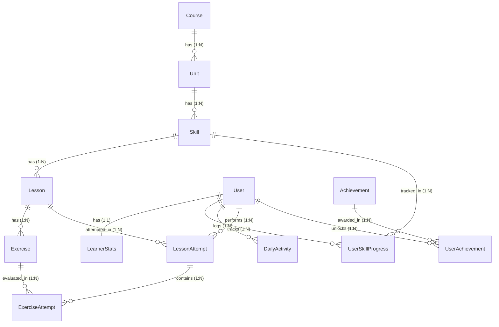

# LingoLoop — Language Learning Platform

LingoLoop is an original full-stack language-learning web application built with Next.js (App Router, TypeScript, Tailwind CSS, Framer Motion, Lucide) and FastAPI (Python, SQLAlchemy, SQLite, Pydantic).

LingoLoop structures learning around a proven cognitive loop:

$$\text{Learn} \longrightarrow \text{Practice} \longrightarrow \text{Recall} \longrightarrow \text{Earn} \longrightarrow \text{Repeat}$$

---

## Implementation Status

### Phase 1: Project Foundation (Completed)
- [x] **Monorepo Architecture**: Clean separation between `frontend/` and `backend/`.
- [x] **Design System & Tokens**: Warm palette (`INK`, `CREAM`, `CORAL`, `VIOLET`, `SUN`, `AQUA`, `MINT`) in Tailwind v4 `@theme`.
- [x] **Typography**: Google Fonts `Plus Jakarta Sans` and `Nunito Sans` with system fallbacks.
- [x] **Branding Assets**: `Logo.tsx` (vector loop wordmark) and `MiloMascot.tsx` (original speech-bubble companion mascot).
- [x] **Health Verification**: Live backend health connection pill.

### Phase 2: Database Architecture + Seed Data (Completed)
- [x] **SQLAlchemy 2.x Domain Models**: 13 entities with explicit `order_index` fields and composite unique constraints.
- [x] **Typed Exercise JSON Payloads**: Pydantic schemas validating all 5 exercise formats (`multiple_choice`, `translate`, `match_pairs`, `fill_blank`, `type_answer`).
- [x] **Idempotent Seed Script**: Complete Spanish curriculum (1 Course, 3 Units, 9 Skills, 18 Lessons, 90 Exercises) + learner **Ankush** via `python -m seed.seed`.

### Phase 3: Core Learning Path & Course API Layer (Completed)
- [x] **Backend API & Service Layer**: Modular routers and services (`CourseService`, `LearnerService`) serving `courses/active`, `courses/{id}/map`, `skills/{id}`, `learners/current`, `learners/current/next-lesson`.
- [x] **Top Bar Live Stats**: Live pills displaying **Momentum (120 XP)**, **Streak (🔥 3)**, **Hearts (❤️ 4/5)**, **Sparks (✨ 80)**, and user profile badge.
- [x] **Continue Learning Hero Card**: Contextual recommendation calculating the exact next actionable lesson (**Meet & Greet • Lesson 2: How Are You?**).
- [x] **Connected Loop Map Experience**: Thematic unit blocks containing 9 tactile Loop Island skill nodes connected via a continuous ribbon track.
- [x] **Progress State Mapping**: Visually displays Completed (👑 Crown 1 + check), In Progress (active glowing pulse + `1/2` lesson counter), Unlocked, and Locked nodes.
- [x] **Interactive Skill Detail Drawer**: Shows skill metadata, lesson breakdown with completion checkmarks, XP rewards, and primary CTA.
- [x] **Robust State Handling**: Shimmer loading skeletons, friendly Milo error screen with retry button, and empty state fallbacks.

---

## Entity-Relationship (ER) Architecture



---

## Getting Started

### 1. Backend Setup & Seeding

```bash
cd backend
pip install -r requirements.txt
python -m seed.seed
uvicorn app.main:app --reload --port 8000
```

Verify backend health: `http://localhost:8000/api/health`
Interactive API Docs: `http://localhost:8000/docs`

### 2. Frontend Setup

```bash
cd frontend
npm install
npm run dev
```

Open in browser: `http://localhost:3000`

---

## Roadmap

- **Phase 4**: Lesson Player & Multi-format Exercise Interactive Engine.
- **Phase 5**: Gamification Engine (Hearts regen, dynamic leaderboard, streak freezing, and XP rewards).
- **Phase 6**: User Profile, Learning Statistics, & Compounding Mastery Review.
