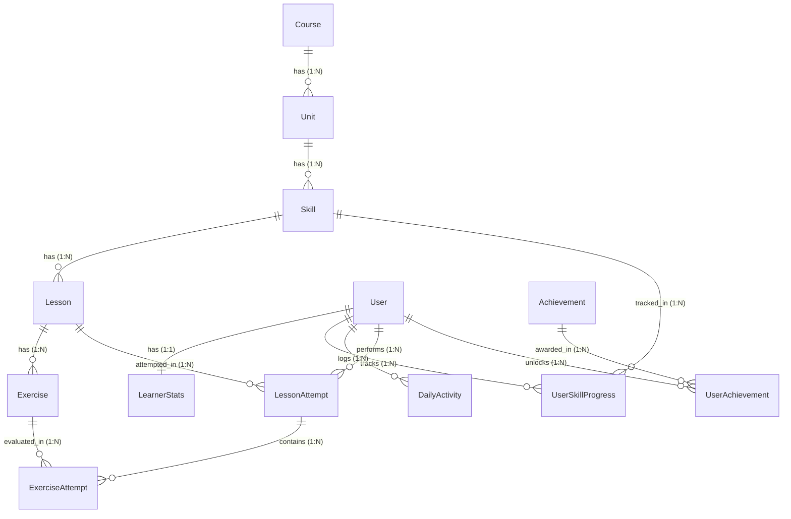

# LingoLoop — Language Learning Platform

LingoLoop is an original full-stack language-learning web application built with Next.js (App Router, TypeScript, Tailwind CSS, Framer Motion, Lucide) and FastAPI (Python, SQLAlchemy, SQLite, Pydantic).

LingoLoop structures learning around a proven cognitive loop:

$$\text{Learn} \longrightarrow \text{Practice} \longrightarrow \text{Recall} \longrightarrow \text{Earn} \longrightarrow \text{Repeat}$$

---

## Implementation Status

### Phase 1: Project Foundation (Completed)
- [x] **Monorepo Architecture**: Clean separation between `frontend/` and `backend/`.
- [x] **Design System & Tokens**: Warm palette (`INK`, `CREAM`, `CORAL`, `VIOLET`, `SUN`, `AQUA`, `MINT`) in Tailwind v4 `@theme`.
- [x] **Typography**: Google Fonts `Plus Jakarta Sans` and `Nunito Sans` with system fallbacks.
- [x] **Branding Assets**: `Logo.tsx` (vector loop wordmark) and `MiloMascot.tsx` (original speech-bubble companion mascot).
- [x] **Welcome Landing Preview**: Interactive 5-step learning loop preview and live backend health connection pill.

### Phase 2: Database Architecture + Seed Data (Completed)
- [x] **SQLAlchemy 2.x Domain Models**:
  - `Course` → `Unit` → `Skill` → `Lesson` → `Exercise` (with explicit `order_index` and composite unique constraints).
  - `User` and `LearnerStats` (`total_xp`, streaks, hearts, gems, daily goal).
  - `UserSkillProgress` (tracks distinct lessons completed and crown level) and `DailyActivity` (tracks daily minutes, XP, active days).
  - `LessonAttempt` (session-level scores, XP, hearts lost) and `ExerciseAttempt` (submission answers, correctness, attempt number).
  - `Achievement` and `UserAchievement`.
- [x] **Typed Exercise JSON Payloads**: Pydantic schemas validating all 5 exercise formats (`multiple_choice`, `translate`, `match_pairs`, `fill_blank`, `type_answer`).
- [x] **Derived Leaderboard Architecture**: No redundant `Leaderboard` table; rankings are computed dynamically from `LearnerStats` and `DailyActivity`.
- [x] **Backend Progression Rules**: Lesson completion advances skill progress on distinct lessons; completing all lessons in a skill advances `crown_level` and unlocks subsequent skills on the backend.
- [x] **Idempotent Seed Script**: Seeds *Spanish for English Speakers* (1 Course, 3 Units, 9 Skills, 18 Lessons, 90 Exercises) and learner **Ankush** with coherent progress history via `python -m seed.seed`.

---

## Entity-Relationship (ER) Architecture



---

## Getting Started

### 1. Backend Setup & Seeding

```bash
cd backend
pip install -r requirements.txt
python -m seed.seed
uvicorn app.main:app --reload --port 8000
```

Verify backend health: `http://localhost:8000/api/health`
Interactive API Docs: `http://localhost:8000/docs`

### 2. Frontend Setup

```bash
cd frontend
npm install
npm run dev
```

Open in browser: `http://localhost:3000`

---

## Roadmap

- **Phase 3**: Core Learning Path (Loop Map), Lesson Player, Exercise Components, & Audio Integration.
- **Phase 4**: Gamification Engine (XP/Momentum, Hearts, Streaks, Daily Goals, & Dynamic Leaderboard).
- **Phase 5**: User Profile, Learning Statistics, & Compounding Mastery Review.
